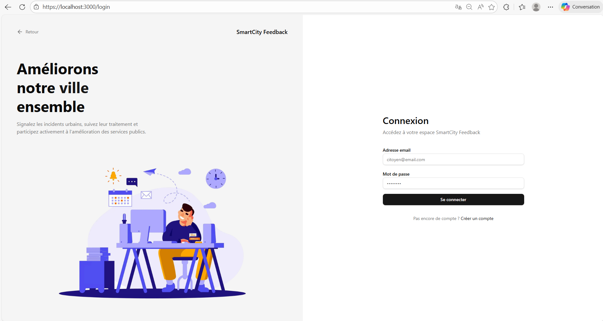
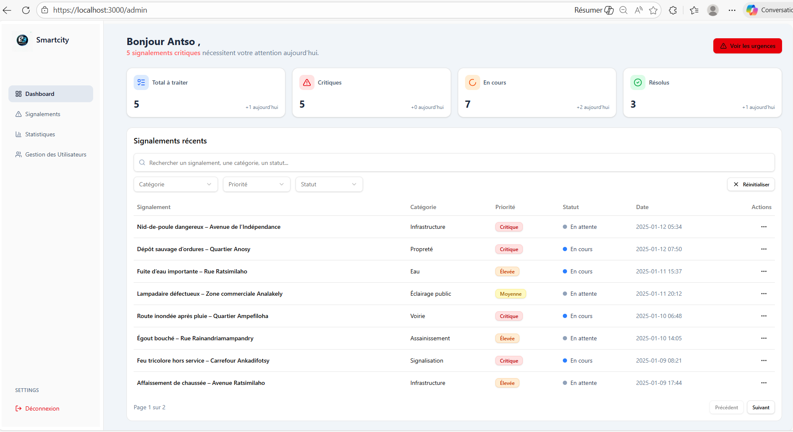

# Smart City – Urban Incident Management Platform

---

## Overview

Smart City est une application web conçue pour permettre aux citoyens de signaler rapidement des incidents urbains (routes dégradées, éclairage public défectueux, infrastructures endommagées, etc.) et aux administrateurs de centraliser leur traitement via un tableau de bord de supervision.

L’objectif est d’améliorer la réactivité des services urbains grâce à une plateforme numérique moderne, sécurisée et intuitive.

---

## Features

### Citizen Side
- Signalement d’incidents
- Ajout de description détaillée
- Localisation des incidents
- Consultation du suivi de traitement
- Interface responsive

### Administration Dashboard
- Gestion centralisée des signalements
- Mise à jour des incidents
- Tableau de bord analytique
- Suivi de résolution

### Priority Levels
Chaque incident possède un niveau de priorité :

- **Bas**
- **Moyen**
- **Élevé**
- **Critique**

---

## Tech Stack

| Layer | Technologies |
|-------|-------------|
| Frontend | Next.js, TailwindCSS, ShadCN UI |
| Backend | Django, Django REST Framework |
| Database | PostgreSQL (Aiven Cloud) |
| Security | Local HTTPS with mkcert |

---

## installation
cd backend

# Create virtual environment
python -m venv venv

# Activate environment
# Linux / macOS
source venv/bin/activate

# Windows
venv\Scripts\activate

# Install dependencies
pip install -r requirements.txt

# Configure environment variables
cp .env.example .env

# Apply migrations
python manage.py migrate

# Run server
python manage.py runserver

## frontend
cd frontend

# Install dependencies
npm install

Configure Local HTTPS

mkcert -install
mkcert localhost 127.0.0.1 ::1
npm run dev
---
## Aperçu

### Application Mobile
<div align="center">
  
  
  
  
  
  
  


### Dashboard Web


## Project Structure

```bash
smart-city/
│
├── back-smartcity/
│   ├── manage.py
│   ├── requirements.txt
│   └── ...
│
├── front-smarticity/
│   ├── app/
│   ├── components/
│   └── ...
│
└── README.md

